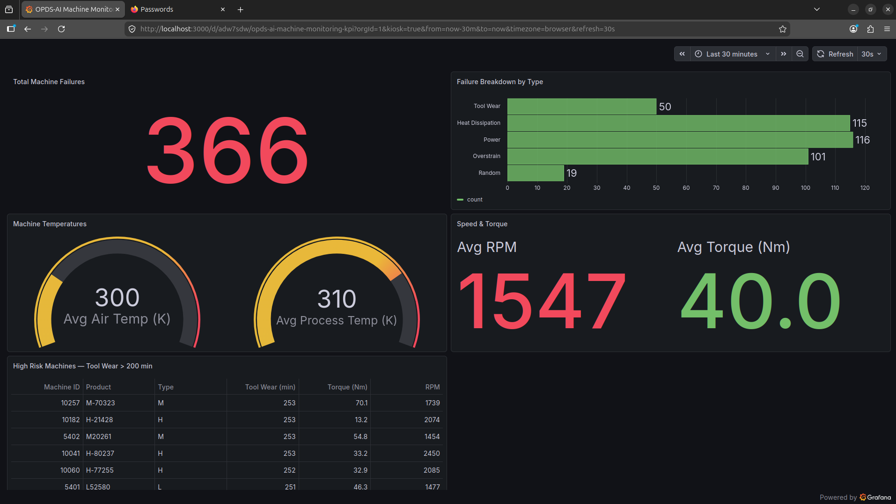
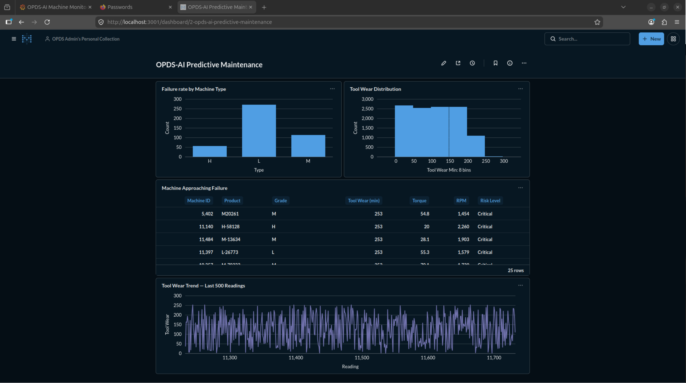
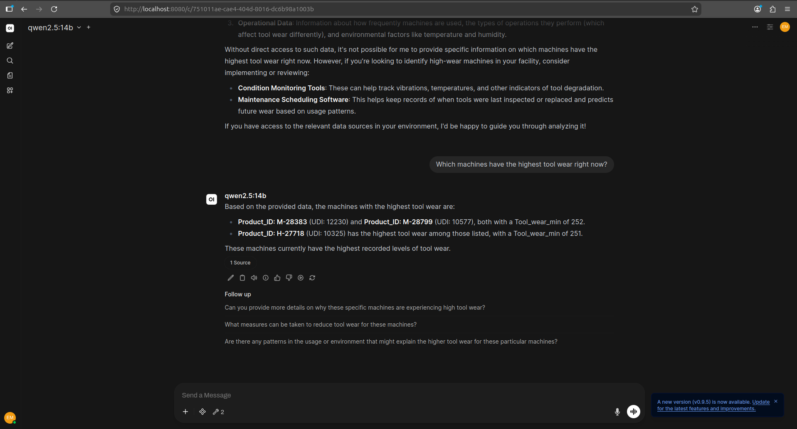
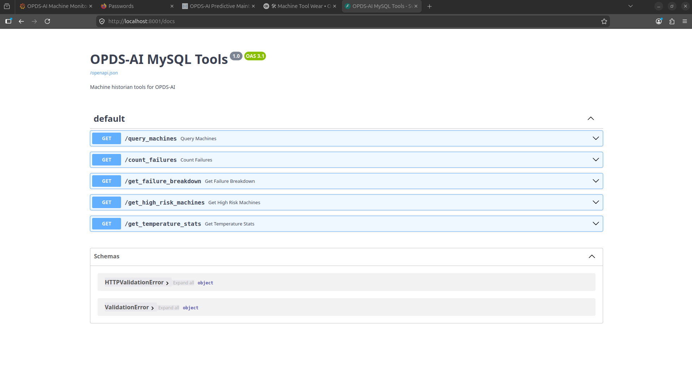

# OPDS-AI — On-Premise Decision Support AI

> **Fully local, edge-deployed AI system for industrial machine monitoring and predictive maintenance.**  
> No cloud. No subscriptions. No data leaves the building.

---

## Screenshots

| Grafana KPI Dashboard | Metabase Predictive Maintenance |
|---|---|
|  |  |

| OpenWebUI — LLM with Real Data | FastAPI Tool Server |
|---|---|
|  |  |

---

## What This Is

OPDS-AI is a proof-of-concept edge AI system built for industrial decision support. An engineer types a plain-English question — *"Which machines have the highest tool wear right now?"* — and the LLM queries the live machine historian database and returns a data-backed answer with source citations. No hallucination. No cloud API calls. No latency from an external service.

The entire stack runs on a single edge PC with AMD GPUs, containerised with Docker, and fully reproducible.

---

## Stack

| Layer | Component | Details |
|---|---|---|
| **LLM Inference** | Ollama + qwen2.5:14b | Native install, ROCm GPU acceleration, 100% GPU, 17GB VRAM |
| **Chat Interface** | OpenWebUI | Port 8080 — tool-calling enabled, citation badges |
| **Tool Server** | FastAPI | Port 8001 — 5 tools exposing MySQL historian data to the LLM |
| **Historian DB** | MySQL 8.0 | Port 3306 — 10,000 row AI4I predictive maintenance dataset |
| **KPI Dashboard** | Grafana | Port 3000 — 5-panel live dashboard, 30s auto-refresh |
| **BI Dashboard** | Metabase | Port 3001 — predictive maintenance analytics |
| **Data Simulator** | Python | Inserts realistic machine readings every 2 seconds |
| **GPU Stack** | AMD ROCm 7.2.2 | Both GPUs detected — gfx1100 architecture |

---

## Hardware

| Component | Spec |
|---|---|
| CPU / Board | AMD X570-Taichi |
| GPU (primary) | AMD RX 7900 XTX × 2 (24GB VRAM each) |
| RAM | 64GB |
| OS | Ubuntu 24.04 LTS |
| Mini PC (portable) | RX 7800 XT 16GB eGPU — same Docker stack validated |

---

## Architecture

```
Engineer / Supervisor
        │
        ▼
  OpenWebUI (8080)          Grafana KPI (3000)      Metabase BI (3001)
        │                         │                        │
        ▼                         │                        │
  Ollama qwen2.5:14b              │                        │
  (native, ROCm GPU)              │                        │
        │                         │                        │
        ▼                         ▼                        ▼
  FastAPI Tool Server (8001)
        │
        ▼
  MySQL 8.0 Historian (3306)
  production_historian.ai4i_maintenance
        ▲
        │
  Python Data Simulator
  (2s interval, realistic sensor readings)
```

---

## FastAPI Tools — 5 Endpoints

| Endpoint | Description |
|---|---|
| `GET /query_machines` | Query machines by type, failure status, or tool wear threshold |
| `GET /count_failures` | Count total machine failures in the historian |
| `GET /get_failure_breakdown` | Failure counts by type (TWF, HDF, PWF, OSF, RNF) |
| `GET /get_high_risk_machines` | Machines with tool wear > 200 min, ordered by risk |
| `GET /get_temperature_stats` | Average air and process temperatures across all machines |

The LLM calls these endpoints as tools — every answer is grounded in real database data. **Zero hallucination validated** — 339 failures confirmed via LLM tool call, exact match to direct SQL query.

---

## Grafana Dashboard — 5 Panels

| Panel | Visualisation | Metric |
|---|---|---|
| Total Machine Failures | Stat (red threshold >300) | COUNT of failure events |
| Failure Breakdown by Type | Horizontal bar chart | TWF / HDF / PWF / OSF / RNF |
| Machine Temperatures | Gauge (295K–315K range) | Avg air temp, avg process temp |
| Speed & Torque | Stat panel | Avg RPM, Avg Torque (Nm) |
| High Risk Machines | Table | Tool wear >200 min, top 20 |

Auto-refresh: 30 seconds. Accessible from tablets on the same LAN.

---

## Metabase Dashboard — 4 Panels

| Panel | Type |
|---|---|
| Failure Rate by Machine Type | Bar chart (H / L / M grade) |
| Tool Wear Distribution | Histogram (8 bins, 0–253 min) |
| Machines Approaching Failure | Table with Risk Level column |
| Tool Wear Trend — Last 500 Readings | Time series line chart |

---

## Data Simulator

Generates realistic machine sensor readings every 2 seconds and inserts them into the MySQL historian.

- Sine wave temperature drift with random noise
- Realistic failure probability thresholds (not deterministic)
- Machine types: L (low), M (medium), H (high) grade
- Resets to 10,000 row baseline on startup — prevents data drift
- Capped at 50,000 rows (~10MB) — controls disk growth

---

## Quick Start

### Prerequisites

- Ubuntu 24.04 LTS
- Docker Engine + Docker Compose v2 (official, not snap)
- AMD ROCm 7.2+ installed
- Ollama installed natively with qwen2.5:14b pulled

### 1. Clone the repo

```bash
git clone https://github.com/erick-m-lean-analytics/opds-ai.git
cd opds-ai
```

### 2. Start all services

```bash
docker compose up -d
```

Expected output — 5 containers started:
- `opds-mysql-historian` (port 3306)
- `opds-mcp-mysql` (port 8001)
- `opds-brain` (port 8080)
- `opds-grafana` (port 3000)
- `opds-metabase` (port 3001)

### 3. Start the data simulator

```bash
nohup python3 simulator.py > simulator.log 2>&1 &
```

### 4. Verify live data

```bash
curl -s http://localhost:8001/count_failures
```

Should return the current failure count from the live database.

### 5. Connect tool server to OpenWebUI

1. Open `http://localhost:8080`
2. Profile icon → Admin Panel → Settings → Tools
3. Add Tool Server: `http://127.0.0.1:8001`
4. Start chatting — ask: *"Which machines have the highest tool wear right now?"*

---

## Service URLs

| Service | URL |
|---|---|
| OpenWebUI (LLM Chat) | http://localhost:8080 |
| Grafana KPI Dashboard | http://localhost:3000 |
| Grafana Kiosk Mode | http://localhost:3000/d/adw7sdw/opds-ai-machine-monitoring-kpi?orgId=1&kiosk |
| Metabase BI | http://localhost:3001 |
| FastAPI Tool Server | http://localhost:8001 |
| FastAPI Docs | http://localhost:8001/docs |

---

## Key Technical Decisions

| Decision | Rationale |
|---|---|
| FastAPI instead of MCPO proxy | MCPO env var passing was broken — FastAPI is simpler, more reliable, OpenWebUI reads it identically |
| Ollama native (not Docker) | Docker ROCm GPU passthrough on AMD is complex — native Ollama uses ROCm directly |
| `network_mode: host` for all containers | Allows all containers to use `127.0.0.1` consistently — no bridge DNS resolution issues |
| qwen2.5:14b as primary model | Fits in one GPU at 17GB VRAM — best tool-calling capability at this size |
| Simulator resets to 10k rows on start | Prevents data drift — clean baseline every boot |

---

## Validated Capabilities

| Capability | Evidence |
|---|---|
| Local AI inference — no cloud | qwen2.5:14b running 100% on AMD GPU — no internet required after model download |
| Zero hallucination | 339 failures confirmed via LLM tool call — exact match to direct SQL query |
| Live KPI dashboard | Grafana 30s auto-refresh — real temperatures, RPM, torque, failure counts |
| Remote access | Grafana and OpenWebUI accessible from tablet on same WiFi |
| Natural language queries | Engineer asks plain English — LLM returns data-backed answer with citations |
| Portable stack | Entire system runs in Docker — validated on mini PC with RX 7800 XT eGPU |
| Zero software cost | All components open source — AUD $0 ongoing licensing |
| Data sovereignty | 100% on-premise — no data leaves the building |

---

## Roadmap

### Phase 3 — Planned
- **OR Solver** — HiGHS + PuLP for maintenance scheduling optimisation
- **Knowledge Graph** — Kuzu for machine relationships and failure dependencies
- **Web Scraping** — Crawl4AI for parts availability and supplier lead times
- **ML Model** — scikit-learn Level 2 predictive scoring written back to MySQL
- **LangChain Agent** — orchestrating OR solver, knowledge graph, MySQL, and web scraping together

### Phase 4–6 — Expansion Use Cases
- Supply chain optimisation (minimise procurement cost)
- Resource scheduling (staff and equipment)
- Demand forecasting (Prophet / statsmodels)

---

## Dataset

Built on the [AI4I 2020 Predictive Maintenance Dataset](https://archive.ics.uci.edu/dataset/601/ai4i+2020+predictive+maintenance+dataset) — 10,000 real machine sensor records with failure labels across 5 failure modes (Tool Wear, Heat Dissipation, Power, Overstrain, Random).

---

## ⚠️ Security Notice

This is a proof-of-concept deployment. Credentials are stored in plain text and services run over HTTP. **Do not deploy in production without:**

- Moving secrets to `.env` or Docker secrets
- Enabling UFW firewall (allow 3000/3001/8080 from LAN only)
- Adding HTTPS via Nginx
- Enabling role-based user accounts

Production hardening steps are documented in `docs/STANDARDISED_WORK_v2.0.docx`.

---

## Author

**erick-m-lean-analytics** — Independent project, May 2026.  
Built as a demonstration of edge AI deployment for industrial decision support.

---

*OPDS-AI — On-Premise Decision Support AI*
